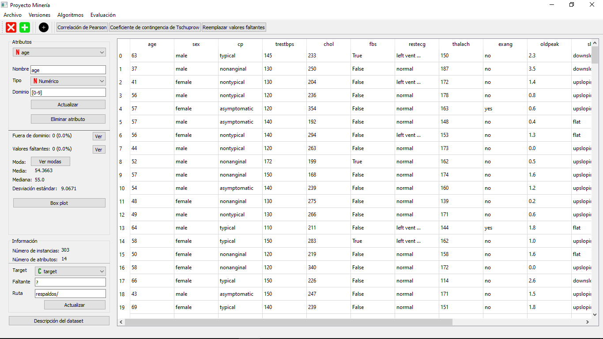

# proyecto_mineria
Programa de escritorio desarrollado en Python y PyQt para el procesamiento de datos con uso de algoritmos de minería de datos

## Algoritmos de minería de datos implementados:
- Zero-R
- One-R
- Naive Bayes
- k-NN
- k-means

## Algoritmos implementados para evaluar modelos:
- k-Fold Cross Validation
- Hold-out

